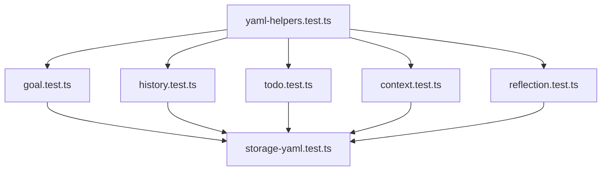

# Design: YAML Schema Test Coverage

## Architecture

### Test Organization

Tests are organized by layer and responsibility:

```
src/utils/
├── yaml-helpers.test.ts     # Foundation - YAML parsing/serialization
├── goal.test.ts             # Extended - Goal YAML format
├── history.test.ts          # Extended - History YAML format
├── todo.test.ts             # New - Todo YAML format
├── context.test.ts          # New - Context YAML format
├── reflection.test.ts       # New - Reflection YAML format
└── storage-yaml.test.ts     # Integration - End-to-end workflows
```

### Testing Strategy

#### 1. Foundation Layer (yaml-helpers.test.ts)
Tests core YAML utilities that all serializers depend on:

- **YAML Parsing**: `parseYamlFrontMatter()` with valid/invalid inputs
- **YAML Serialization**: `serializeYamlFrontMatter()` with metadata/body
- **Format Detection**: `detectFormat()` for YAML vs inline
- **Schema Normalization**: `normalizeSchemaVersion()` with various inputs
- **Entry Splitting**: `splitEntries()` for YAML and inline formats

**Why separate file?** These are low-level utilities used by all entry types. Testing them independently ensures bugs don't propagate to higher layers.

#### 2. Entry Type Layer (Extended/New Test Files)
Tests serialization/parsing for each entry type:

**Pattern for each entry type:**
```typescript
describe('EntryType YAML serialization', () => {
  it('should serialize with schema_version')
  it('should serialize with all fields')
  it('should serialize without optional fields')
  it('should parse YAML format')
  it('should parse inline format (backward compat)')
  it('should auto-detect format')
  it('should handle missing schema_version')
  it('should round-trip correctly')
})
```

**Why extend existing files?** Goal and history tests already exist for inline format. We extend them rather than create new files to keep all goal/history tests together.

**Why create new files?** Todos, context, and reflections have no existing test files, so we create comprehensive test files for them.

#### 3. Integration Layer (storage-yaml.test.ts)
Tests end-to-end workflows:

- **Round-trip**: Write entry → Read entry → Verify identical
- **Mixed formats**: File with both YAML and inline entries
- **Migration**: Inline format automatically upgraded to YAML
- **Multi-entry**: Multiple entries in same file

**Why separate file?** Integration tests cross multiple modules and test the system as a whole rather than individual functions.

## Key Design Decisions

### 1. Test Independence

Each test is self-contained:
- No shared state between tests
- No dependencies on file system (use in-memory strings)
- No dependencies on other tests

**Rationale**: Isolated tests are easier to debug and can run in parallel.

### 2. Backward Compatibility Testing

Every parser has explicit tests for inline format:
```typescript
it('should parse inline format for backward compatibility', () => {
  const inlineEntry = `## 10:30\n\nEntry text`;
  const result = parseEntryAuto(inlineEntry);
  expect(result).not.toBeNull();
})
```

**Rationale**: Ensures users' existing data continues to work after YAML migration.

### 3. Schema Version Testing Strategy

Three categories of tests:
1. **Present & Valid**: `schema_version: "1.0"` → accepts
2. **Missing**: No schema_version → defaults to "1.0"
3. **Unknown**: `schema_version: "2.0"` → warns, defaults to "1.0"

**Rationale**: Covers all schema version scenarios users might encounter.

### 4. Round-Trip Verification

For each entry type:
```typescript
it('should round-trip serialize and parse correctly', () => {
  const original = createEntry();
  const serialized = serialize(original);
  const parsed = parse(serialized);
  expect(parsed).toEqual(original);
})
```

**Rationale**: Proves serialization/parsing are inverses with no data loss.

## Testing Patterns

### Pattern 1: Parameterized Tests

For schema version normalization:
```typescript
describe('normalizeSchemaVersion', () => {
  test.each([
    [undefined, '1.0'],
    ['1.0', '1.0'],
    ['2.0', '1.0'], // warns
    ['', '1.0'],
  ])('normalizes %s to %s', (input, expected) => {
    expect(normalizeSchemaVersion(input)).toBe(expected);
  });
});
```

**Benefit**: Tests multiple cases concisely without duplication.

### Pattern 2: Snapshot Testing (Avoided)

We do **not** use snapshot testing for YAML serialization.

**Rationale**: YAML output must be predictable. Explicit assertions are clearer than snapshots.

### Pattern 3: Helper Functions

Create test helpers for common operations:
```typescript
function createTestGoal(overrides = {}): GoalEntry {
  return {
    timestamp: '10:30',
    codename: 'test-goal',
    text: 'Test goal',
    deadline: null,
    description: null,
    rawEntry: '',
    ...overrides,
  };
}
```

**Benefit**: Reduces boilerplate and makes tests more readable.

## Error Handling

Tests verify error cases:

1. **Invalid YAML**: `parseYamlFrontMatter()` returns null
2. **Malformed entries**: Parsers return null, don't throw
3. **Unknown schema versions**: Logs warning, doesn't fail

**Rationale**: Graceful degradation is better than crashing.

## Performance Considerations

- **Fast tests**: No file I/O, all in-memory operations
- **Parallel execution**: Tests are independent, can run concurrently
- **Focused assertions**: Test one thing per test case

**Target**: Entire test suite should run in < 5 seconds.

## Future Extensions

This design supports future additions:

1. **New entry types**: Follow same pattern (serialize/parse/auto/round-trip)
2. **Schema v2.0**: Add tests for version migration
3. **New YAML fields**: Add tests for backward compatibility

## Trade-offs

| Decision | Benefit | Cost |
|----------|---------|------|
| Separate yaml-helpers.test.ts | Clear separation of concerns | One more test file to maintain |
| Extend existing test files | Keep related tests together | Files grow larger |
| No snapshot testing | Explicit, predictable tests | More verbose test code |
| In-memory testing | Fast, isolated tests | Doesn't test file I/O |
| Round-trip tests | High confidence in correctness | More test code to write |

## Dependencies



**Rationale**: Foundation layer must pass before entry type tests make sense. Entry type tests must pass before integration tests are meaningful.
